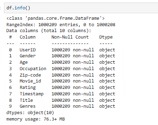
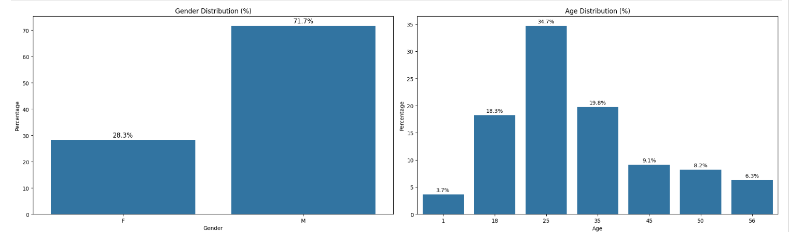
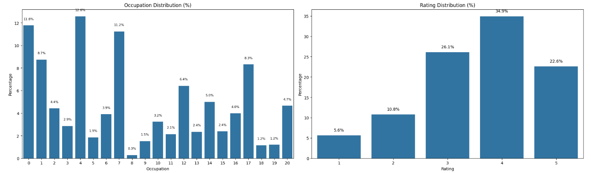
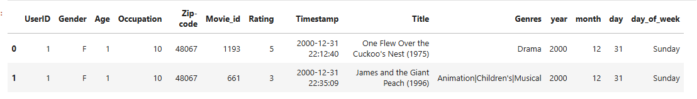

# Problem Statement

Aim is to build:

1. a ***personalized movie recommender system*** that predicts user preferences using ***user ratings, demographics, and movie details***
2. The system should accurately suggest movies to users, enhancing ***user engagement***, increasing satisfaction, and creating a more intuitive movie-watching experience

# EDA

 

* Some of the columns like user id, age, ratings, etc have been assigned ***'object'*** data type which is wrong. Therefore, will be changed to ***'int'***
* Timestamp is in ***unix*** form which will be converted to ***date_time***

1. Rows: ***10,00,209*** ratings
2. Users: ***6,040 (UserID from 1 to 6040)***
3. Movies: ***~3952 unique Movie_ids***
4. Ratings: Range from 1 to 5, with a ***mean of 3.58*** → generally positive ratings
5. Age: Mean age ~29.7; most users aged ***25–35***. Age 1 may need cleaning
6. Occupation: Numeric codes (0–20); further decoding needed
7. Timestamp: Ratings span from ***Apr 2000 to Feb 2003*** — nearly ***3 years*** of data

**Uni-variate Analysis:**

1. No. of Genres - 301
2. No. of unique locations ( zipcodes ) - 3439
3. Gender: ***72% Male***, 28% Female
4. Age: Majority (~35%) are aged ***25***
5. Occupation: Most users belong to occupations ***4, 0, and 7***, each around 11–13%
6. Rating: Around ***80%*** of users given rating ***>= 3***

# Data Pre-Processing

***Missing Values:***

 

* No missing values in the data

***Extracting Time Based Features:***

      df['year'] = df['Timestamp'].dt.year
      df['month'] = df['Timestamp'].dt.month
      df['day'] = df['Timestamp'].dt.day
      df['day_of_week'] = df['Timestamp'].dt.day_name()

 

# Model Building

### Collaborative Filtering

* Collaborative Filtering is a recommendation technique that suggests items to a user based on the preferences of similar users (user-based) or similar items (item-based)
* It relies on user-item interaction data (like ratings or clicks) without requiring item content. This approach helps uncover hidden patterns and personalized recommendations even for diverse item types

***User-Item Matrix:***

Each row represents a user and each column represents an item. The values are known interactions (e.g., ratings), and the goal is to predict ***missing values***

      # user-item matrix
      
      user_item_matrix = df.pivot_table(index = 'UserID', columns = 'Movie_id', values = 'Rating') # user interactions
      user_item_matrix

***User-User Similarity Matrix:***

It is a square matrix where each cell (u,v) contains the similarity score between users u & v, based on their interactions (e.g., ratings or clicks) across items

 

      # Cosine similarity - computes similarity between rows
      
      from sklearn.metrics.pairwise import cosine_similarity 
      
      user_similarity = cosine_similarity(user_item_matrix.fillna(0))  # user-user similarity
      user_similarity_df = pd.DataFrame(user_similarity, index = user_item_matrix.index, columns = user_item_matrix.index)
      user_similarity_df

 
